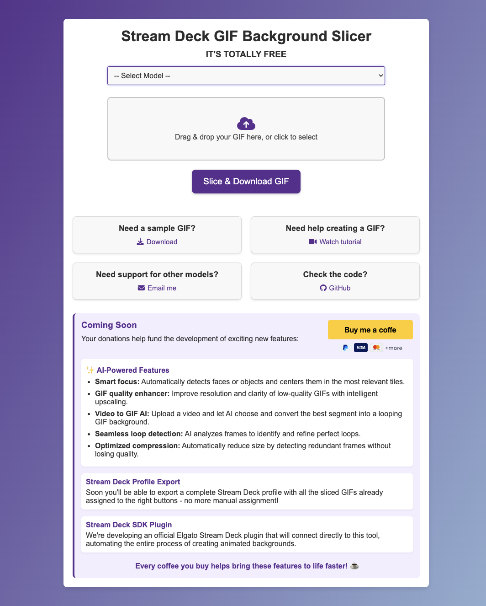

# Stream Deck GIF Background Slicer

This project is designed to **recut** larger GIFs into multiple smaller **animated** GIFs sized for Elgato’s Stream Deck models, including **Stream Deck**, **Stream Deck Plus** and **Stream Deck XL**. It also supports a real **drag & drop** area for convenient file selection and automatically zips the sliced GIF tiles for easy download.

You can also **use this tool online** at [https://sdbg.crabstudio.com.ar/](https://sdbg.crabstudio.com.ar/)

---

---

## Features

- **Drag & drop** or manual selection of your GIF file.  
- **Automatic slicing** of the GIF frames into 96×96 tiles.  
- **Separate** each tile into a fully animated mini-GIF.  
- **Package** all mini-GIFs into a single ZIP for easy download.  
- **Sample GIF** available for both models (288x192 for mini, 480x288 for regular, 384×192 for Plus/Neo and 768×384 for XL,) to test or verify correct dimensions.

---

## Supported Models

| Model                | GIF Dimensions | Tile Size | Grid Layout |
|----------------------|----------------|-----------|-------------|
| **Stream Deck Mini** | 288×192        | 96×96     | 2×3         |
| **Stream Deck**      | 480×288        | 96×96     | 5×3         |
| **Stream Deck Plus** | 384×192        | 96×96     | 4×2         |
| **Stream Deck Neo**  | 384×192        | 96×96     | 4×2         |
| **Stream Deck XL**   | 768×384        | 96×96     | 8×4         |

---

## Installation

1. **Clone or download** this repository to your server or local environment.  
2. Run `composer install` (make sure PHP and Composer are installed).  
3. Ensure the **Imagick** extension is enabled in your PHP environment.  
4. Place your project folder where it can be accessed via a browser (e.g., under your server’s document root).
5. Make sure the `temp/` directory is **writable** by the web server.

---

## Requirements

- **PHP 7.4+ or 8+** (with the Imagick extension).  
- **Composer** for autoloading dependencies.  
- **Write permissions** on the `temp/` folder.

---

## Usage

1. **Access the Tool**  
   - Open the `index.php` from your project folder in a browser, or visit [https://sdbg.crabstudio.com.ar/](https://sdbg.crabstudio.com.ar/).
2. **(Optional) Download a Sample GIF**  
   - Click **Download** to get a pre-sized GIF for your selected model:
     - **Stream Deck Mini**: 288x192
     - **Stream Deck**: 480×288
     - **Stream Deck Plus/Neo**: 384×192
     - **Stream Deck XL**: 768×384
3. **Select Your Model**  
   - Use the dropdown to select **Stream Deck Mini**, **Stream Deck**, **Stream Deck Plus | Neo** or **Stream Deck XL**.
4. **Drag & Drop or Click**  
   - Drag your GIF onto the box or click to open the file dialog.  
   - You should see the file name appear once it’s selected.
5. **Upload**  
   - Click **Upload GIF**. A “Please wait” message shows while slicing is in progress.
6. **Download**  
   - You’ll be prompted to download a ZIP once the process is complete.  
   - This ZIP contains multiple sub-GIFs named `tile_r#_c#.gif` ([see naming convention](#tile-naming-convention)).
7. **Apply to Stream Deck**  
   - In your Stream Deck software, assign each button its corresponding mini-GIF.  
   - When placed correctly, the Stream Deck recreates the original GIF across all buttons.

---

### Tile Naming Convention

The naming convention for the tiles corresponds to their position on the Stream Deck grid:

- `tile_r0_c0.gif`: First button in the first row (top-left corner).  
- `tile_r0_c1.gif`: Second button in the first row.  
- `tile_r0_c2.gif`: Third button in the first row.  
- ...  
- `tile_r1_c3.gif`: Fourth button in the second row.  

This pattern continues for all rows and columns, where `r` represents the row number (starting from 0) and `c` represents the column number (starting from 0).

---

## Future Support for Other Models

- The code is structured so you can add new **tile sizes** in `src/Entity/tile_size.php` or adapt `GifProcessController`.  

---

## Troubleshooting

- **Missing Imagick**:  
  - Install or enable the PHP Imagick extension through your OS or hosting environment.  
- **Permissions**:  
  - The script must write to `temp/`. Ensure it’s writable.
- **Large GIFs**:  
  - For huge animations, you may need to increase `memory_limit` and `max_execution_time`.

---

## Contributing

- Pull requests are welcome on [GitHub](https://github.com/sebastiansperandio/Stream-Deck-BG).  
- Email [sebastiansperandio@gmail.com](mailto:sebastiansperandio@gmail.com) for advanced questions or new model requests.

Enjoy your custom Stream Deck XL animations! 
