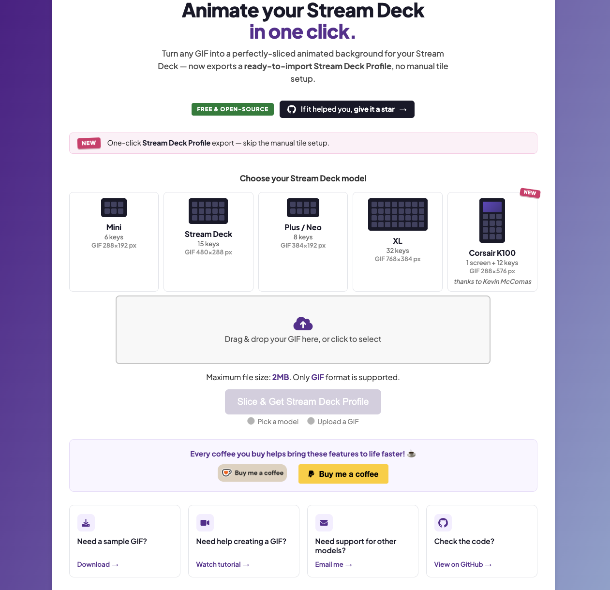

# Stream Deck GIF Background Slicer

This project is designed to **recut** larger GIFs into multiple smaller **animated** GIFs sized for Elgato's Stream Deck models, including **Stream Deck Mini**, **Stream Deck**, **Stream Deck Plus**, **Stream Deck Neo** and **Stream Deck XL**. It also supports a real **drag & drop** area for convenient file selection and automatically zips the sliced GIF tiles for easy download.

🌐 **Use it online at [https://sdbg.speran.dev](https://sdbg.speran.dev)**

---



---

## Features

- **Visual model picker** — pick your Stream Deck device from cards that show the actual button-grid layout (Mini, Stream Deck, Plus/Neo, XL).
- **Drag & drop** or manual selection of your GIF file.
- **Smart dimension check** — validates your GIF size against the selected model before processing and blocks invalid uploads with a clear message.
- **Automatic slicing** of the GIF frames into 96×96 tiles.
- **Separate** each tile into a fully animated mini-GIF.
- **Package** all mini-GIFs into a single ZIP for easy download.
- **Export as `.streamDeckProfile`** — import directly into the Stream Deck app with tiles pre-assigned. 🆕
- **Auto-download** of the ZIP as soon as processing is complete.
- **Confetti celebration** 🎉 when your GIF is ready.
- **Sample GIFs** available for all models to test correct dimensions.
- **100% client-side processing** — your GIF never leaves your browser.

---

## Supported Models

| Model                | GIF Dimensions | Tile Size | Grid Layout | Notes |
|----------------------|----------------|-----------|-------------|-------|
| **Stream Deck Mini** | 288×192        | 96×96     | 2×3         |       |
| **Stream Deck**      | 480×288        | 96×96     | 5×3         |       |
| **Stream Deck Plus** | 384×192        | 96×96     | 4×2         |       |
| **Stream Deck Neo**  | 384×192        | 96×96     | 4×2         |       |
| **Stream Deck XL**   | 768×384        | 96×96     | 8×4         |       |
| **Corsair K100**     | 288×576        | 96×96     | 3×4 + screen | Outputs `screen.gif` (top 288×192 display) + 12 button tiles. Use with Corsair iCUE; `.streamDeckProfile` export is skipped. Support added thanks to **Kevin McComas**. |

---

## Tech Stack

This project was migrated from PHP to **Next.js** to enable seamless deployment on Vercel and eliminate server-side binary dependencies.

| Layer | Technology |
|-------|-----------|
| Framework | [Next.js](https://nextjs.org/) (App Router) |
| Language | TypeScript |
| Styling | CSS (ported from original styles) + Tailwind CSS |
| GIF Decoding | [`gifuct-js`](https://github.com/matt-way/gifuct-js) |
| GIF Encoding | [`gif-encoder-2`](https://github.com/benjaminadk/gif-encoder-2) |
| ZIP Packaging | [`jszip`](https://stuk.github.io/jszip/) |
| Deployment | [Vercel](https://vercel.com) |

> All GIF processing happens **entirely in the browser** — no files are sent to any server.

---

## Installation (Local Development)

1. **Clone** this repository:
   ```bash
   git clone https://github.com/sebastiansperandio/Stream-Deck-BG.git
   cd Stream-Deck-BG
   ```
2. **Install dependencies**:
   ```bash
   npm install
   ```
3. **Run the development server**:
   ```bash
   npm run dev
   ```
4. Open [http://localhost:3000](http://localhost:3000) in your browser.

---

## Requirements

- **Node.js 18+**
- **npm** (comes with Node.js)

> No PHP, no Composer, no server extensions required.

---

## Deployment (Vercel)

This project is optimized for Vercel. To deploy your own instance:

1. Push the repository to GitHub.
2. Import it in [vercel.com](https://vercel.com) — Vercel will auto-detect Next.js.
3. Click **Deploy**. Done.

Or via CLI:
```bash
npx vercel --prod
```

---

## Usage

1. **Open the Tool**
   - Visit [https://sdbg.speran.dev](https://sdbg.speran.dev) or run locally.
2. **(Optional) Download a Sample GIF**
   - Click **Download** to get a pre-sized GIF for your selected model:
     - **Stream Deck Mini**: 288x192
     - **Stream Deck**: 480×288
     - **Stream Deck Plus/Neo**: 384×192
     - **Stream Deck XL**: 768×384
3. **Select Your Model**
   - Click on the card matching your Stream Deck device. Each card shows the actual button layout and the GIF size required.
4. **Drag & Drop or Click**
   - Drag your GIF onto the drop zone or click to open the file dialog.
   - The file name will appear once selected. If the dimensions don't match the selected model, an error message will explain exactly what's needed.
5. **Process**
   - Click **Slice & Get Stream Deck Profile**. A "Please wait" message shows while slicing is in progress.
6. **Download**
   - The ZIP will **download automatically** once processing is complete.
   - Two download options are shown on the success screen:
     - **Download GIF Tiles (ZIP)** — individual GIF files named `tile_r#_c#.gif`.
     - **Export as Stream Deck Profile (`.streamDeckProfile`)** — ready to import directly into Stream Deck.
7. **Apply to Stream Deck — Option A: Manual (ZIP)**
   - In your Stream Deck software, assign each button its corresponding mini-GIF.
   - When placed correctly, the Stream Deck recreates the original GIF across all buttons.
8. **Apply to Stream Deck — Option B: Profile Import (recommended)**
   - Open the **Stream Deck** app.
   - Go to **Profiles → Import...**
   - Select the downloaded `.streamDeckProfile` file.
   - The profile will appear with all GIF tiles pre-assigned to buttons! 🎉

---

### Tile Naming Convention

The naming convention for the tiles corresponds to their position on the Stream Deck grid:

- `tile_r1_c1.gif`: First button in the first row (top-left corner).
- `tile_r1_c2.gif`: Second button in the first row.
- `tile_r1_c3.gif`: Third button in the first row.
- ...
- `tile_r2_c4.gif`: Fourth button in the second row.

This pattern continues for all rows and columns, where `r` represents the row number and `c` represents the column number (both starting from 1).

---

## Project Structure

```
Stream-Deck-BG/
├── public/
│   ├── img/          # Demo images and Stream Deck device previews
│   └── sample/       # Sample GIFs for each model
├── src/
│   ├── app/
│   │   ├── globals.css   # Global styles
│   │   ├── layout.tsx    # Root layout
│   │   └── page.tsx      # Main page
│   ├── components/
│   │   └── UploadForm.tsx  # Main drag-and-drop UI component
│   └── utils/
│       ├── processGif.ts   # GIF decoding and tile slicing
│       ├── createZip.ts    # ZIP packaging of GIF tiles
│       └── exportProfile.ts # Stream Deck .streamDeckProfile generator
├── package.json
└── tsconfig.json
```

---

## Future Support / Roadmap

- ✨ **AI-Powered Features**: Smart focus detection, GIF quality enhancer, Video-to-GIF.
- 🎮 **Stream Deck WebHID Integration**: Auto-detect your device model and push GIFs directly to buttons without importing any file.

---

## Contributing

- Pull requests are welcome on [GitHub](https://github.com/sebastiansperandio/Stream-Deck-BG).
- Email [sebastiansperandio@gmail.com](mailto:sebastiansperandio@gmail.com) for advanced questions or new model requests.

---

## Acknowledgments

- **Kevin McComas** — for requesting support for the Corsair K100 SD and helping figure out the composite screen + button-grid layout.

---

## Author & Attribution

> 🏆 **This is the original Stream Deck GIF Background Slicer**, pioneered in 2024 by **Sebastian Sperandio**.
>
> If you found this tool elsewhere, you're likely looking at a copy. This is the source.

Developed with ❤️ by **Sebastian Sperandio**
- 📧 [sebastiansperandio@gmail.com](mailto:sebastiansperandio@gmail.com)
- 💻 [GitHub @sebastiansperandio](https://github.com/sebastiansperandio)

Enjoy your custom Stream Deck animations! 🎉
